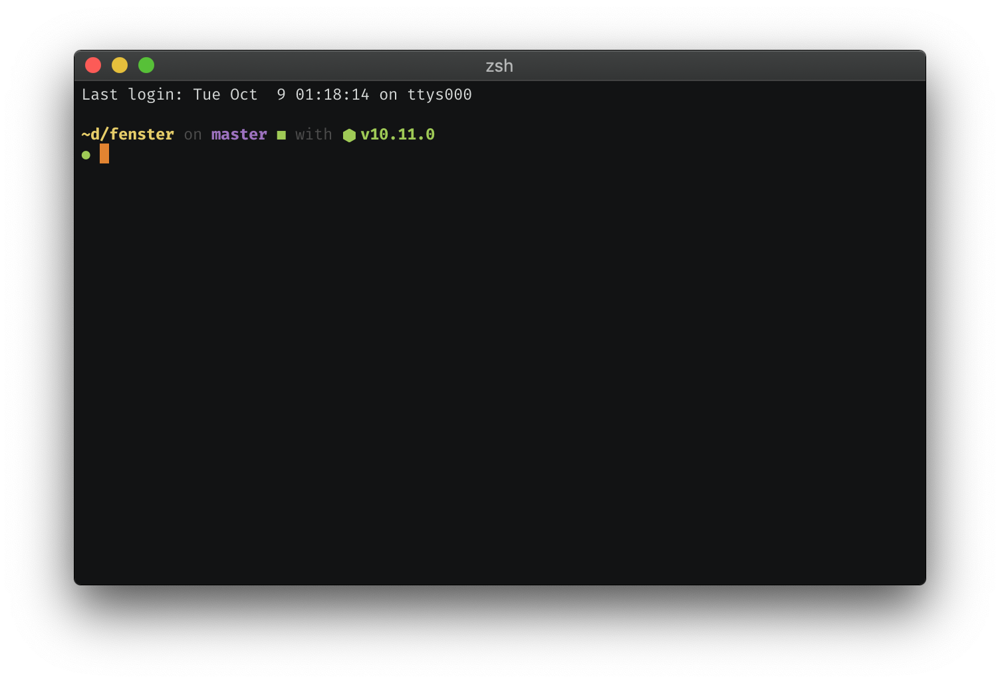

<div align="center">
  
</div>

> nigiri is a fast, modular and customizable zsh prompt using async functions, inspired by
> [spaceship-prompt](https://github.com/denysdovhan/spaceship-prompt/) and [pure](https://github.com/sindresorhus/pure).

<div align="center">
  
</div>

# Table of Contents

- [Install](#install)
- [Configuration](#install)
  - [cwd](#cwd)
  - [exit_status](#exit_status)
  - [git](#git)
  - [newline](#newline)
  - [node](#node)
  - [wild_nigiri](#wild_nigiri)
- [Write your own module](#write-your-own-module)
- [Attributions](#attributions)
- [License](#license)

# Install

### [antibody](https://github.com/getantibody/antibody)

```sh
antibody bundle mafredri/zsh-async
antibody bundle timomeh/nigiri
```

### [antigen](https://github.com/zsh-users/antigen)

```sh
antigen bundle mafredri/zsh-async
antigen theme https://github.com/timomeh/nigiri nigiri
```

### [oh-my-zsh](https://github.com/robbyrussell/oh-my-zsh)

tdb.

### [zplug](https://github.com/zplug/zplug)

```sh
zplug "mafredri/zsh-async"
zplug "timomeh/nigiri", as:theme
```


# Configuration

Use the variable `NIGIRI_PROMPT_MODULES` to define the order of the modules in
your prompt. Default is:

```sh
NIGIRI_PROMPT_MODULES=(
  newline
  cwd
  git
  # node
  wild_nigiri
  newline
  exit_status
)
```

You can simply copy this into your `.zshrc` before you load nigiri, and modify it to your liking.

Use the variable `NIGIRI_PS2` to set the PS2. It defaults to `%F{black}⣿%f  `.

## `cwd`

`cwd` shows the current working directory.

| Variable | Description | Default |
| - | - | - |
| **`NMOD_CWD_FORMAT`** | Format of the module's output, where `CWD` will be replaced with the current working directory. | `%B%F{yellow}CWD %f%b` |


## `exit_status`

`exit_status` shows an indicator based on the exit code of the last command.

| Variable | Description | Default |
| - | - | - |
| **`NMOD_EXIT_STATUS_GOOD`** | String to print on success. | `%F{green}● %f` |
| **`NMOD_EXIT_STATUS_BAD`** | String to print on failure. | `%F{red}● %f` |

## `git`

`git` shows the current branch and status of your working tree.

| Variable | Description | Default |
| - | - | - |
| **`NMOD_GIT_FORMAT`** | Format of the module's output, where `GIT` will be replaced with the whole output. | `%F{black}on%f GIT` |
| **`NMOD_GIT_BRANCH_FORMAT`** | Format of the branch section, where `BRANCH` will be replaced with the branch name. | `%B%F{magenta}BRANCH%f%b` |
| **`NMOD_GIT_AHEAD_FORMAT`** | Format for the number of ahead commits, where `NUM` will be replaced with the number. | `%B%F{red}⇡NUM%f%b` |
| **`NMOD_GIT_BEHIND_FORMAT`** | Format for the number of behind commits, where `NUM` will be replaced with the number. | `%B%F{red}⇣NUM%f%b` |
| **`NMOD_GIT_UNTRACKED`** | String to print for untracked files. | `%F{red}■%f` |
| **`NMOD_GIT_CHANGED`** | String to print for changed files. | `%F{yellow}■%f` |
| **`NMOD_GIT_STAGED`** | String to print for staged files. | `%F{blue}■%f` |
| **`NMOD_GIT_DETACHED`** | String to print when HEAD is detached. | `%F{blue}■%f` |
| **`NMOD_GIT_CLEAN`** | String to print when working tree is clean. | `%F{green}■%f` |
| **`NMOD_GIT_MERGE`** | String to print while merging. | `%B%F{red}(merge)%f%b` |
| **`NMOD_GIT_REBASE`** | String to print while rebasing. | `%B%F{red}(rebase)%f%b` |

## `newline`

`newline` shows a line break.

## `node`

`node` shows the currently active node version.

| Variable | Description | Default |
| - | - | - |
| **`NMOD_NODE_CMD`** | Command to run to get the current node version. | `nvm current` |
| **`NMOD_NODE_FORMAT`** | Format of the module's output, where `NODE` will be replaced with the node version. | `%F{black}with%f %B%F{green}⬢ NODE%f%b` |

## `wild_nigiri`

`wild_nigiri` has a 1:200 chance of showing a 🍣

| Variable | Description | Default |
| - | - | - |
| **`NMOD_WILD_NIGIRI_CHANCE`** | Chance that a wild nigiri shows up, as percentage between 0 and 1. | `0.005` |

# Write your own module

nigiri consists of modules which compose the shell prompt. Each module is a
function, and the output of this function (using `echo`) will be added to the
prompt.

1. Create a new zsh file for your module, e.g. `ohai.zsh`. Define the
   function `nigiri_module::ohai` inside it:

   ```sh
   function nigiri_module::ohai() {
     echo -n "ohai marc."
   }
   ```

2. `source` the file before you load nigiri:

   ```sh
   source ohai.zsh
   ```

3. Add the module to `NIGIRI_PROMPT_MODULES`:

   ```sh
   NIGIRI_PROMPT_MODULES=(
     # ...
     ohai
     # ...
   )
   ```

Check out [`exit_status`](modules/exit_status.zsh) for an example of a simple module
or [`async_example`](modules/async_example.zsh) for a module utilizing async
functions.

If you wrote a module, why not share your work with others and open a [pull request](https://github.com/timomeh/nigiri/pulls).

# Attributions

The sushi-emoji is part of [Noto Color Emoji from Google](https://www.google.com/get/noto/help/emoji/)
and licensed under the [Apache License 2.0](https://github.com/googlei18n/noto-emoji/blob/master/LICENSE).

nigiri is heavily inspired by [denysdovhan/spaceship-prompt](https://github.com/denysdovhan/spaceship-prompt/)
and [sindresorhus/pure](https://github.com/sindresorhus/pure) and wouldn't exist without
their work.

nigiri would not be possible without the awesome work of [mafredri/zsh-async](https://github.com/mafredri/zsh-async).

# License

MIT © Timo Mämecke
