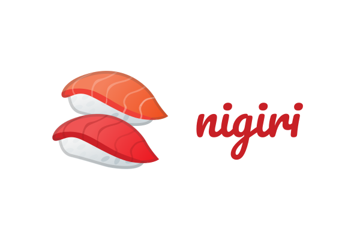

<div align="center">
  
</div>

> nigiri is a fast, modular and customizable zsh prompt inspired by
> [spaceship-prompt](https://github.com/denysdovhan/spaceship-prompt/) and [pure](https://github.com/sindresorhus/pure).

<div align="center">
  
</div>

# Install

I'm using zplug, so that's everything I know. [zsh-async](https://github.com/mafredri/zsh-async)
is a required dependency and needs to be loaded before nigiri.

```
zplug "mafredri/zsh-async"
zplug "timomeh/nigiri", as:theme
```

```
TODO: Add more installation guides
```

# Configuration

Use the variable `NIGIRI_PROMPT_MODULES` to define the order of the modules in
your prompt. Default is:

```
NIGIRI_PROMPT_MODULES=(
  newline
  cwd
  git
  node
  newline
  exit_status
)
```

# Add modules

nigiri consists of modules which compose the shell prompt. Each module is a
function called `nigiri_module::my_module()`. The output of this function
(using `echo`) is added to the prompt.

Check out [`exit_status`](modules/exit_status.zsh) for a simple module example
or [`async_example`](modules/async_example.zsh) for a module utilizing async functions.

You can `source` your module before loading nigiri and add your module to `NIGIRI_PROMPT_MODULES`,
to add it to your prompt.

# Attributions

The sushi-emoji is part of [Noto Color Emoji from Google](https://www.google.com/get/noto/help/emoji/)
and licensed under the [Apache License 2.0](https://github.com/googlei18n/noto-emoji/blob/master/LICENSE).

# License

MIT © Timo Mämecke
